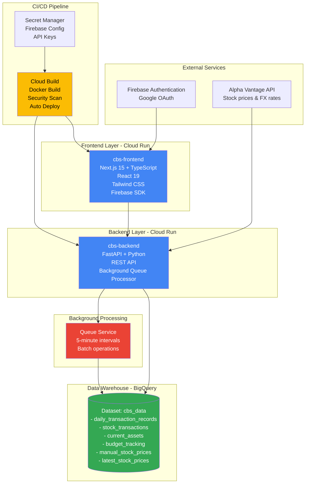
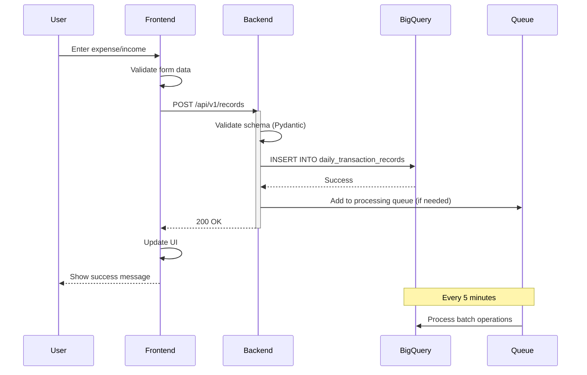
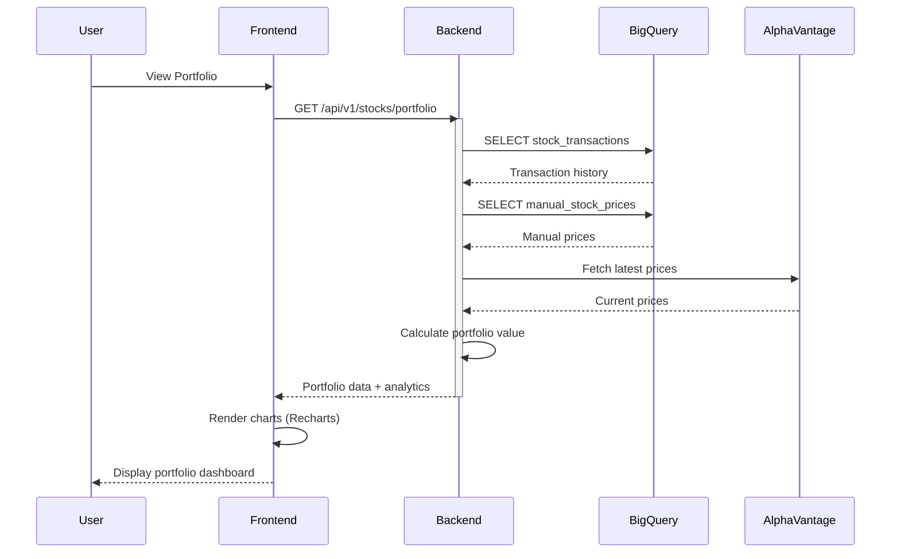
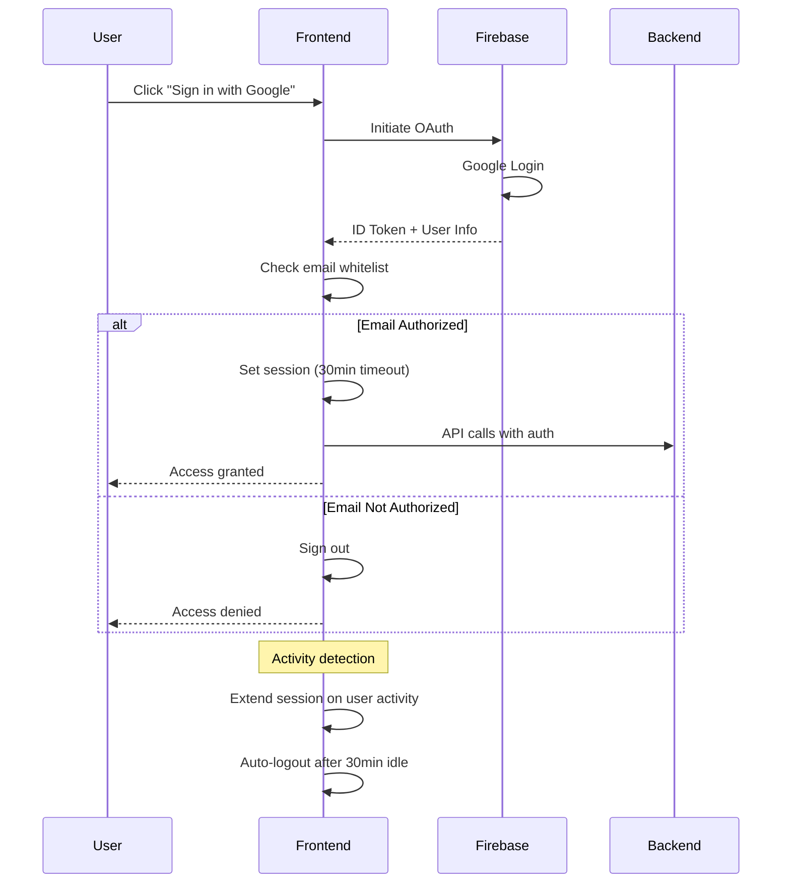

# Personal Finance Management System - Architecture Documentation

> Complete technical documentation for the personal finance management platform

## Quick Navigation

| Section | Description |
|---------|-------------|
| [Architecture Overview](#architecture-overview) | System architecture and component relationships |
| [Service Catalog](#service-catalog) | All services and their details |
| [Data Flow](#data-flow) | How data flows through the system |
| [GCP Resources](#gcp-resources) | BigQuery, Cloud Run, and other GCP services |
| [API Endpoints](#api-endpoints) | REST API documentation |
| [Tech Stack](#tech-stack) | Technologies and frameworks |

---

## Architecture Overview

### High-Level Architecture



### Technology Stack

| Layer | Technology | Purpose |
|-------|-----------|---------|
| **Frontend** | Next.js 15 + React 19 + TypeScript | Modern, type-safe UI framework |
| **Styling** | Tailwind CSS 4 | Utility-first CSS with responsive design |
| **Authentication** | Firebase Auth + Google OAuth | Secure user authentication with email whitelist |
| **Backend** | FastAPI + Python 3.9+ | High-performance async REST API |
| **Data Warehouse** | BigQuery | Serverless, cost-optimized analytics database |
| **Visualization** | Recharts | Interactive financial charts and dashboards |
| **Deployment** | Cloud Run | Serverless container platform |
| **CI/CD** | Cloud Build + Docker | Automated build, scan, and deployment |
| **Secrets** | Secret Manager | Secure credential management |

---

## Service Catalog

### 1. Frontend Application

| Property | Value |
|----------|-------|
| **Name** | project-2b-cbs-v1-frontend |
| **Repository** | `project-2b-cbs` (private) |
| **Deployment** | Cloud Run (asia-northeast1) |
| **Framework** | Next.js 15.5.2 + React 19 |
| **Language** | TypeScript 5 |
| **Build Tool** | Turbopack (Next.js) |
| **Responsibility** | User-facing dashboard for personal finance management |

**Key Features:**
- **Authentication**: Firebase Google OAuth with email whitelist
- **Session Management**: 30-minute idle timeout with activity detection
- **Responsive Design**: Mobile-first approach with glassmorphism UI
- **Real-time Charts**: Recharts integration for portfolio and expense visualization
- **Multi-Currency**: JPY/USD support with exchange rate handling

**Pages & Components:**
- Dashboard (BudgetWatcher)
- Daily Entry Form (Expense/Income tracking)
- Expense Browser (Search & filter transactions)
- Stock Portfolio (Investment tracking)
- Listings Manager (Asset management)
- Advanced Analytics (Financial insights)

### 2. Backend API

| Property | Value |
|----------|-------|
| **Name** | project-2b-cbs-v1-api |
| **Repository** | `project-2b-cbs` (private) |
| **Deployment** | Cloud Run (asia-northeast1) |
| **Framework** | FastAPI |
| **Language** | Python 3.9+ |
| **Server** | Uvicorn (ASGI) |
| **Responsibility** | REST API for all business logic and data operations |

**Core Services:**
- `record_service.py` - Transaction CRUD operations
- `stats_service.py` - Analytics and aggregations
- `budget_service.py` - Budget tracking and alerts
- `stock_service.py` - Portfolio management
- `manual_stock_price_service.py` - Manual price entry for unlisted stocks
- `current_assets_service.py` - Asset snapshots and tracking
- `queue_service.py` - Retry queue for BigQuery operations

**Background Processing:**
- **Queue Service**: Handles failed UPDATE/DELETE operations caused by BigQuery streaming insert buffer
- **Retry Logic**: Automatic retry with exponential backoff (5 minutes initial, up to 5 attempts)
- **Use Case**: When data is inserted via `insert_rows_json()`, it remains in buffer for several seconds. Immediate UPDATE/DELETE operations fail during this period. Queue service defers these operations until data is committed to physical table.

### 3. BigQuery Data Warehouse

| Property | Value |
|----------|-------|
| **Project** | (Configured via GCP_PROJECT_ID) |
| **Dataset** | cbs_data |
| **Strategy** | Cost-optimized serverless analytics |
| **Cost Model** | Pay-per-query (no 24/7 VM costs) |

**Design Philosophy:**
This application uses **BigQuery instead of PostgreSQL** for strategic reasons:
- 💰 **Cost Efficiency**: No persistent VM costs, pay only for queries
- 🚀 **Serverless**: Zero infrastructure maintenance
- 📊 **Analytics-Ready**: Built-in data warehouse capabilities
- 🔧 **Scalability**: Automatic scaling without capacity planning

For a personal finance app with moderate transaction volume, BigQuery's pay-per-query model is significantly more cost-effective than maintaining a persistent database instance.

---

## Automated Operations

### Stock Price Data Pipeline

| Property | Value |
|----------|-------|
| **Automation** | GitHub Actions |
| **Schedule** | Daily at 8:00 AM JST (UTC 23:00) |
| **Trigger** | Cron-based + Manual dispatch |
| **Script** | `latest_stock_price_fetcher.py` |
| **Data Source** | Alpha Vantage API |
| **Targets** | Stock prices (GOOG, AAPL, MSFT, META, AMZN, NVDA) + USD/JPY exchange rate |
| **Storage** | BigQuery `latest_stock_prices` table |
| **Monitoring** | Email notification on pipeline failure |
| **Logging** | Execution logs retained for 30 days |

**Pipeline Flow:**
1. GitHub Actions triggers Python script daily
2. Fetch latest stock prices from Alpha Vantage API
3. Fetch USD/JPY exchange rate
4. Calculate JPY-denominated prices
5. Insert data into BigQuery via streaming insert
6. Upload execution logs as artifacts
7. Send email notification if any step fails

**Operational Benefits:**
- **Zero-maintenance**: Fully automated with no manual intervention
- **Cost-effective**: GitHub Actions free tier + serverless execution
- **Reliable**: Automatic retry on transient failures
- **Auditable**: 30-day log retention for troubleshooting

---

## Data Model

### Core Tables

| Table Name | Purpose | Key Columns |
|------------|---------|-------------|
| `daily_transaction_records` | All financial transactions | `transaction_id`, `recorded_date`, `transaction_type`, `price_jpy`, `item_category`, `item_subcategory`, `payment_method`, `is_waste`, `is_approved` |
| `stock_transactions` | Buy/Sell/Vest stock trades | `transaction_id`, `transaction_date`, `transaction_type`, `ticker_symbol`, `quantity`, `price_per_share`, `currency`, `commission_jpy` |
| `current_assets` | Asset snapshots | `asset_id`, `snapshot_date`, `service_provider`, `asset_name`, `asset_type`, `balance_jpy`, `balance_usd` |
| `budget_tracking` | Budget allocations | `budget_id`, `year_month`, `category`, `budget_amount`, `actual_amount` |
| `manual_stock_prices` | Unlisted stock prices | `ticker_symbol`, `price_date`, `price_usd`, `source` |
| `latest_stock_prices` | Latest stock price snapshots | `timestamp`, `symbol`, `price`, `usd_jpy_rate`, `price_jpy` |

### Transaction Categories

**Expense Categories:**
- Housing (家賃・住宅)
- Utilities (水道光熱費)
- Food & Dining (食費・外食)
- Transportation (交通費)
- Healthcare (医療費)
- Entertainment (娯楽費)
- Shopping (買い物)
- Subscriptions (サブスク)
- Others (その他)

**Payment Methods:**
- Credit Card (クレジットカード)
- Cash (現金)
- Bank Transfer (銀行振込)
- E-money (電子マネー)
- Debit Card (デビットカード)

---

## Data Flow

### Transaction Entry Flow



### Portfolio Management Flow



### Authentication Flow



---

## API Endpoints

### Records API (`/api/v1/records`)

| Method | Endpoint | Description |
|--------|----------|-------------|
| POST | `/records` | Create single transaction |
| POST | `/records/bulk` | Bulk transaction insert |
| GET | `/records` | Get all transactions (with filters) |
| GET | `/records/{transaction_id}` | Get specific transaction |
| PUT | `/records/{transaction_id}` | Update transaction |
| DELETE | `/records/{transaction_id}` | Delete transaction |
| GET | `/records/search` | Advanced search with filters |

### Stats API (`/api/v1/stats`)

| Method | Endpoint | Description |
|--------|----------|-------------|
| GET | `/stats/monthly-summary` | Monthly expense/income summary |
| GET | `/stats/category-breakdown` | Spending by category |
| GET | `/stats/trends` | Historical trends and patterns |
| GET | `/stats/waste-analysis` | Waste spending analysis |

### Budget API (`/api/v1/budget`)

| Method | Endpoint | Description |
|--------|----------|-------------|
| POST | `/budget` | Create budget allocation |
| GET | `/budget/{year}/{month}` | Get monthly budget |
| PUT | `/budget/{budget_id}` | Update budget |
| GET | `/budget/tracking` | Budget vs actual comparison |

### Stocks API (`/api/v1/stocks`)

| Method | Endpoint | Description |
|--------|----------|-------------|
| POST | `/stocks/transaction` | Record stock trade |
| GET | `/stocks/portfolio` | Get portfolio summary |
| GET | `/stocks/holdings` | Current holdings |
| GET | `/stocks/performance` | Portfolio performance metrics |
| GET | `/stocks/history` | Transaction history |

### Manual Stock Prices API (`/api/v1/manual-stock-prices`)

| Method | Endpoint | Description |
|--------|----------|-------------|
| POST | `/manual-prices` | Add manual stock price |
| GET | `/manual-prices/{ticker}` | Get price history |
| PUT | `/manual-prices/{price_id}` | Update price entry |

### Current Assets API (`/api/v1/current-assets`)

| Method | Endpoint | Description |
|--------|----------|-------------|
| POST | `/assets` | Create asset record |
| GET | `/assets` | Get all current assets |
| GET | `/assets/snapshot/{date}` | Get assets as of date |
| PUT | `/assets/{asset_id}` | Update asset |
| DELETE | `/assets/{asset_id}` | Delete asset |

---

## GCP Resources

### Cloud Run Services

| Service Name | Region | Min Instances | Max Instances | Memory | CPU | Port |
|--------------|--------|--------------|---------------|--------|-----|------|
| `project-2b-cbs-v1-api` | asia-northeast1 | 0 | 10 | 2GB | 1 | 8080 |
| `project-2b-cbs-v1-frontend` | asia-northeast1 | 0 | 10 | 512MB | 1 | 8080 |

### BigQuery Dataset

**Project**: Configured via `GCP_PROJECT_ID` environment variable
**Dataset**: `cbs_data`
**Location**: Multi-region (US or EU depending on configuration)

**Tables:**
- `daily_transaction_records` - ~50KB-1MB (personal use)
- `stock_transactions` - ~10KB-100KB
- `current_assets` - ~5KB-50KB
- `budget_tracking` - ~1KB-10KB
- `manual_stock_prices` - ~1KB-10KB
- `latest_stock_prices` - ~5KB-50KB (historical snapshots)

**Cost Optimization:**
- No partitioning needed for personal scale
- On-demand pricing model
- Estimated monthly cost: $0.50-$2.00 (query processing only)

### Cloud Build

**Trigger:**
- **Type**: Manual or webhook-based
- **Config**: `cloudbuild.yaml`
- **Steps**:
  1. Build frontend Docker image
  2. Push to Container Registry
  3. Security scan with Trivy (CRITICAL vulnerabilities only)
  4. Deploy to Cloud Run

**Build Configuration:**
```yaml
- Frontend build with Secret Manager integration
- Docker multi-stage builds for optimization
- Security scanning before deployment
- Automatic deployment on success
```

### Secret Manager

**Stored Secrets:**
- `NEXT_PUBLIC_VITE_CBS_APP_PASSWORD` - Application password
- `NEXT_PUBLIC_FIREBASE_API_KEY` - Firebase config
- `NEXT_PUBLIC_FIREBASE_AUTH_DOMAIN` - Firebase auth domain
- `NEXT_PUBLIC_FIREBASE_PROJECT_ID` - Firebase project
- `NEXT_PUBLIC_FIREBASE_STORAGE_BUCKET` - Firebase storage
- `NEXT_PUBLIC_FIREBASE_MESSAGING_SENDER_ID` - Firebase messaging
- `NEXT_PUBLIC_FIREBASE_APP_ID` - Firebase app ID

---

## Security & Authentication

### Firebase Authentication

**Provider**: Google OAuth
**Configuration**: Email whitelist for authorized access

**Features:**
- Social login with Google accounts
- Server-side email validation
- Session management with idle timeout
- Automatic sign-out after 30 minutes of inactivity
- Activity detection for session extension

**Implementation:**
```typescript
// AuthContext.tsx
- Context API for global auth state
- onAuthStateChanged listener
- Activity tracking with event listeners
- Automatic logout on idle timeout
```

### CORS Configuration

**Allowed Origins:**
- `http://localhost:5173` (Vite dev)
- `http://localhost:3000` (Next.js dev)
- `http://localhost:3001` (Alternative dev)
- Production frontend URL (Cloud Run deployment)

### Data Security

- **Encryption**: All data encrypted at rest (BigQuery default)
- **Transport**: HTTPS only (Cloud Run enforced)
- **Secrets**: Secret Manager for sensitive credentials
- **Access Control**: IAM-based permissions for GCP resources

---

## Deployment

### CI/CD Pipeline

**Trigger**: Git push to `main` branch
**Platform**: Cloud Build with automatic triggers
**Configuration**: `cloudbuild.yaml`

**Deployment Flow:**
1. Developer pushes code changes to repository
2. Cloud Build trigger automatically activates
3. Docker image build (frontend with Secret Manager integration)
4. Push image to Container Registry (`gcr.io`)
5. Security scan with Trivy (CRITICAL vulnerabilities only)
6. Deploy to Cloud Run (asia-northeast1)
7. Zero-downtime deployment with traffic migration

**Cloud Build Configuration:**
```yaml
steps:
  - Build frontend Docker image with build args
  - Push to gcr.io
  - Security scan (CRITICAL only)
  - Deploy to Cloud Run (asia-northeast1)
availableSecrets:
  - Firebase configuration (7 variables)
  - API keys
options:
  logging: CLOUD_LOGGING_ONLY
```

**CI/CD Features:**
- **Automated Deployments**: No manual intervention required
- **Secret Management**: Secure credential injection via Secret Manager
- **Security Scanning**: Pre-deployment vulnerability detection
- **Rollback Capability**: Cloud Run revision management
- **Zero-Downtime**: Traffic gradually migrates to new version

### Environment Variables

**Frontend:**
```bash
NEXT_PUBLIC_API_URL=<Backend API URL>
NEXT_PUBLIC_FIREBASE_* (7 variables)
NEXT_PUBLIC_VITE_CBS_APP_PASSWORD
```

**Backend:**
```bash
GCP_PROJECT_ID=your-project-id
BIGQUERY_DATASET_ID=cbs_data
```

---

## Cost Optimization Strategy

**Architecture Decision: Serverless vs Traditional**

| Approach | Monthly Cost | Operational Overhead | Scalability |
|----------|-------------|---------------------|-------------|
| Traditional (PostgreSQL + VM) | $25-50 | High (patching, scaling, backup) | Manual capacity planning |
| Serverless (BigQuery + Cloud Run) | $0.30-0.50 | Zero (fully managed) | Automatic (0 to N instances) |
| **Reduction** | **99%** | **Eliminated** | **Automatic** |

**Actual Cost Breakdown (Personal Use):**
- BigQuery: < $0.05/month (storage + queries)
- Cloud Run: $0/month (min instances = 0, pay-per-request)
- Artifact Registry: ~$0.20-0.40/month (shared with other projects)
- Secret Manager: $0.06/month (7 secrets)
- GitHub Actions: $0/month (free tier)
- **Total: ~$0.30-0.50/month**

**Key Decision Factors:**
1. **Pay-per-use pricing**: Eliminates idle infrastructure costs
2. **Auto-scaling from zero**: No capacity planning or over-provisioning
3. **Managed services**: Zero operational overhead (no patching, backups, monitoring)
4. **Cost predictability**: Linear cost scaling with usage

**Scalability Consideration:**
This architecture maintains the same cost efficiency at 10x scale. At 1,000 daily users, estimated cost would be $5-10/month vs $100-200/month for traditional architecture, demonstrating sustainable design decisions.

---

## Technical Highlights

### Frontend Engineering

**Type Safety:**
- 100% TypeScript coverage
- Strict type checking enabled
- Pydantic-style schema validation

**State Management:**
- React Context API for global state
- Custom hooks for reusable logic
- Session persistence with localStorage

**Performance:**
- Next.js Turbopack for fast builds
- Server-side rendering (SSR) support
- Optimized bundle size
- Lazy loading for components

**UI/UX:**
- Glassmorphism design pattern
- Responsive mobile-first layout
- Smooth animations and transitions
- Accessible form inputs

### Backend Engineering

**API Design:**
- RESTful endpoints with proper HTTP methods
- OpenAPI/Swagger auto-documentation
- Pydantic models for validation
- Async/await for I/O operations

**Data Layer:**
- BigQuery client library integration
- Parameterized queries (SQL injection prevention)
- Connection pooling
- Error handling and retries

**Background Processing:**
- Queue service with 5-minute intervals
- Lifespan management for task startup/shutdown
- Graceful error handling
- Batch operation optimization

### DevOps & Infrastructure

**Containerization:**
- Docker multi-stage builds
- Minimal base images (python:slim)
- Layer caching optimization
- .dockerignore for build efficiency

**Security:**
- Secret Manager integration
- Trivy vulnerability scanning
- HTTPS-only enforcement
- IAM least privilege principle

**Monitoring:**
- Cloud Logging for application logs
- Health check endpoints
- Error tracking and alerting
- Request/response logging

---

## Skills Demonstrated

### Full-Stack Development
- Modern web technologies (Next.js 15, React 19, TypeScript)
- Backend API development (FastAPI, Python)
- Database design and optimization (BigQuery)
- Authentication and security (Firebase OAuth)

### Cloud Engineering
- Google Cloud Platform expertise
- Serverless architecture design
- Cost-optimized infrastructure
- CI/CD pipeline automation

### Financial Domain
- Personal finance management
- Investment portfolio tracking
- Multi-currency support
- Budget tracking and analytics

### Software Engineering Best Practices
- Type-safe development (TypeScript + Pydantic)
- RESTful API design
- Component-based architecture
- Documentation and maintainability

### Product Management Skills
- User-centric feature design
- Cost optimization focus
- Scalability planning
- Technical decision documentation

---

## Future Enhancements

### Observability & Monitoring
- [ ] Cloud Monitoring custom metrics
- [ ] Alert policies for errors and latency
- [ ] Uptime checks for frontend/backend
- [ ] Structured logging with severity levels
- [ ] Custom dashboards for KPIs

### Data Pipeline & Analytics
- [ ] dbt transformation layer for marts
- [ ] Automated stock price fetching pipeline
- [ ] Cloud Workflows orchestration
- [ ] Data quality tests and validation
- [ ] Monthly/yearly report generation

### Infrastructure as Code
- [ ] Terraform modules for GCP resources
- [ ] Environment separation (dev/staging/prod)
- [ ] GitOps workflow
- [ ] Automated infrastructure testing

### Testing & Quality
- [ ] Frontend unit tests (Jest + RTL)
- [ ] Backend unit tests (pytest)
- [ ] E2E tests (Playwright/Cypress)
- [ ] API integration tests
- [ ] Performance testing

### Advanced Features
- [ ] Machine learning for spending predictions
- [ ] Portfolio rebalancing recommendations
- [ ] Budget optimization algorithms
- [ ] Expense categorization with NLP
- [ ] Multi-user support with role-based access

---

## Architecture Decisions

### Why BigQuery over PostgreSQL?

**Decision**: Use BigQuery as the primary data warehouse instead of Cloud SQL (PostgreSQL)

**Rationale:**
1. **Cost Optimization**: No 24/7 VM costs, pay only for queries executed
2. **Serverless**: Zero infrastructure maintenance (no patching, scaling, backups)
3. **Analytics-Ready**: Built-in support for complex analytical queries
4. **Scalability**: Automatic scaling without capacity planning
5. **Personal Use Case**: For a personal finance app with <1000 transactions/month, BigQuery's pay-per-query model costs ~$1-2/month vs $25-50/month for Cloud SQL

**Trade-offs:**
- Higher latency per query (~100-500ms vs 10-50ms for PostgreSQL)
- No traditional transactions (eventual consistency)
- Not ideal for high-frequency OLTP workloads

**Conclusion**: For this use case (personal finance with moderate transaction volume and heavy analytics), BigQuery is the optimal choice.

### Why Next.js over React SPA?

**Decision**: Use Next.js with SSR capabilities instead of pure React SPA

**Rationale:**
1. **SEO Potential**: Server-side rendering for better SEO (future blog/documentation)
2. **Performance**: Automatic code splitting and optimization
3. **Developer Experience**: Built-in routing, API routes, TypeScript support
4. **Future-Proof**: Easy to add server-side features later
5. **Modern Tooling**: Turbopack for faster builds

### Why FastAPI over Flask/Django?

**Decision**: Use FastAPI for the backend API

**Rationale:**
1. **Performance**: ASGI async support for concurrent requests
2. **Type Safety**: Built-in Pydantic validation
3. **Documentation**: Automatic OpenAPI/Swagger docs
4. **Modern Python**: Async/await syntax, type hints
5. **Developer Experience**: Fast iteration with auto-reload

---

**Note**: This is a personal finance management application developed to demonstrate full-stack development capabilities, cloud engineering skills, and financial domain expertise. The architecture is designed for cost optimization, scalability, and maintainability, making it suitable for production use at personal scale.
